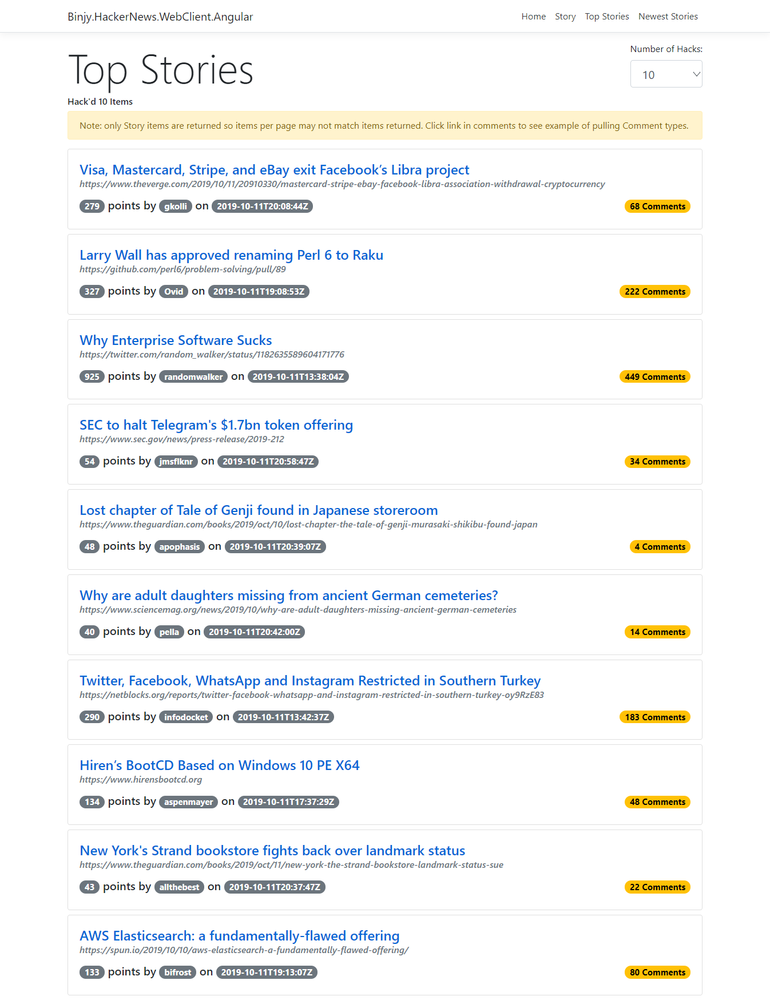
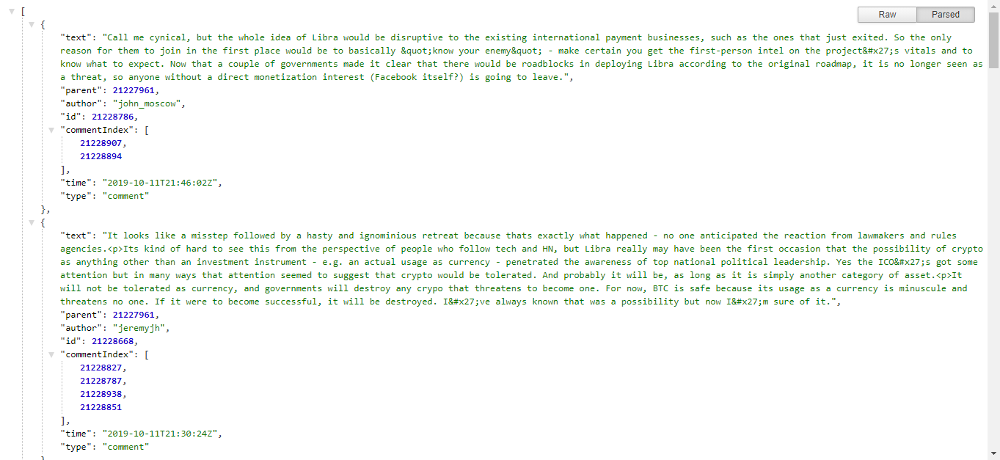

# Binjy.HackerNews

This project is a .Net Core 3.0 project created using Visual Studio 2019 that contains an example client for retrieving results from [HackerNews API](https://github.com/HackerNews/API).  It supports retrieving results for Top Stories, Newest Stories, and Comments.  The client application is an Angular 8 based web app embedded within an ASP.Net Core 3.0 host app (which also hosts the Web API controller that the client app communicates with).

[Live Demo](https://binjyhackernews-dev-as.azurewebsites.net/)

## Top Stories App View

## Comment Parse View

